# NursingHomeProject
Nursing Home Application - it's an Application thats provides tools that help managing :house_with_garden: Nusing Home.
Technologies utilized while builiding this project:
* Windows Forms
* Entity Freamwork
* Auto Mapper
* MS SQL

# Database
### Entity Relationship Diagram (ERD)

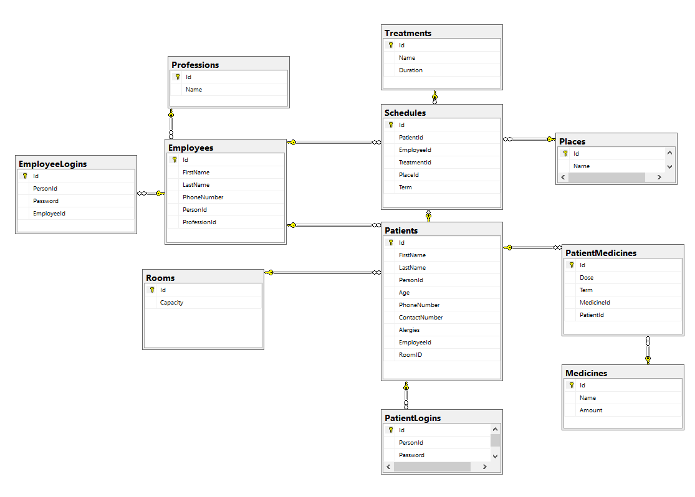
# Forms
## Login Form
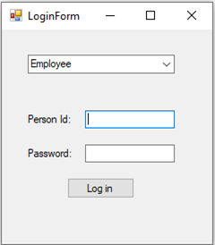
## Patient Form
### Informations
Contains base informations about logged in patient.
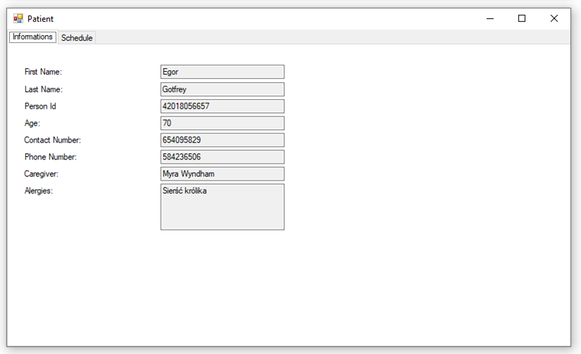
### Schedule
Contains sorted list of patient's treatments.
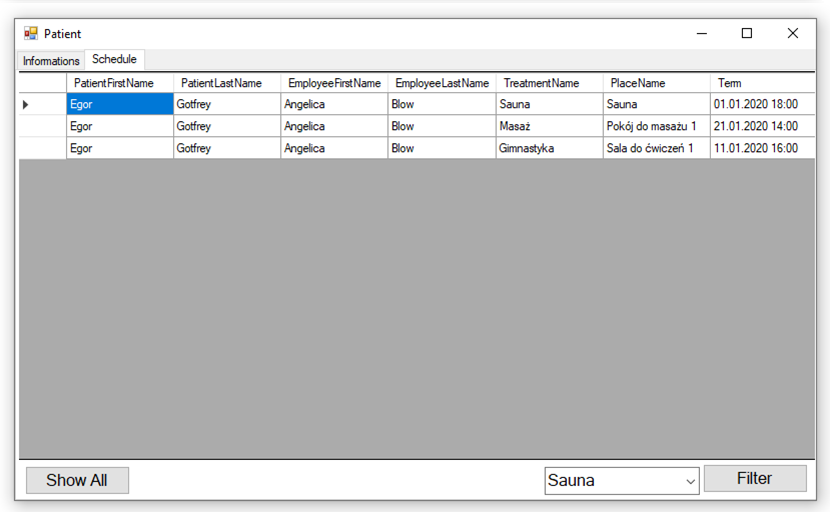
## Administrator Form
### Informations
Contains base informations about logged in employee.
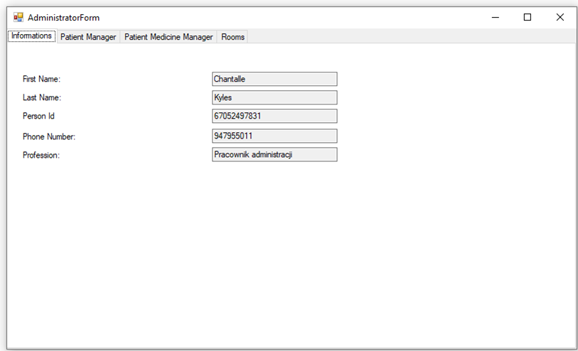
### Patient Manager
Allows to manage patients.
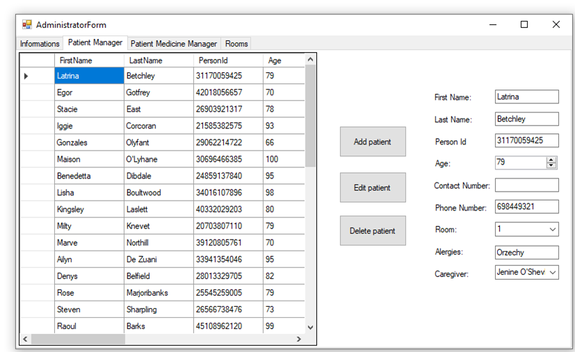
### Patient Medicines Manager
Allows to manage patients medicines.
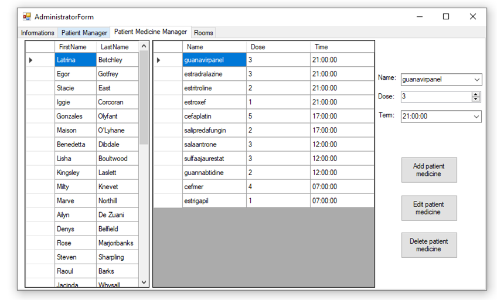
### Room
Allows to list all rooms.
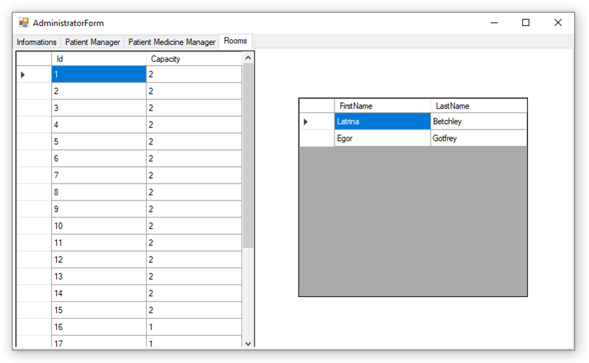
## Nurse Form
### Informations
Contains base informations about logged in employee.
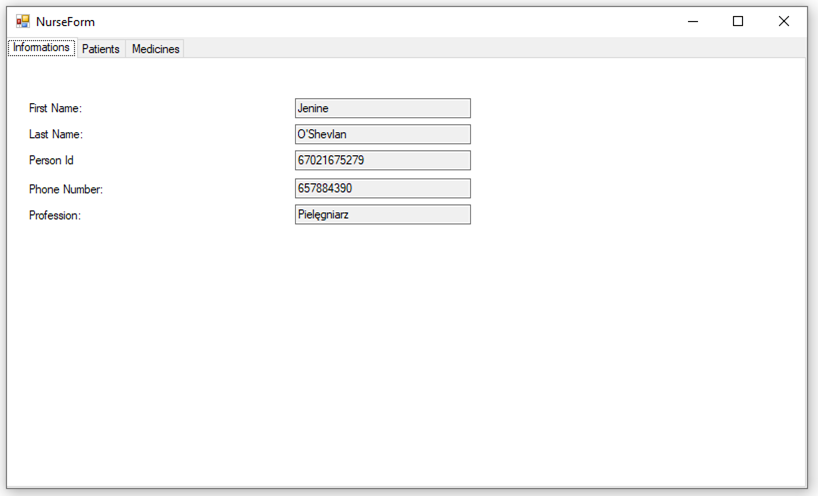
### Patients
Allows to list all patients with their medicines under care of logged in nurse.
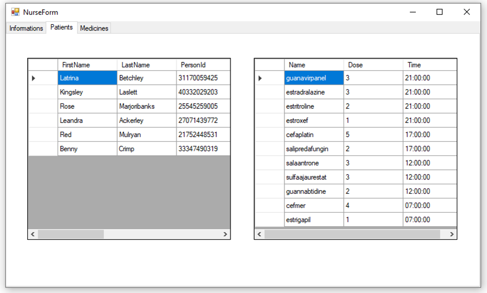
### Medicines
Allows to list all medicines and their stock status.
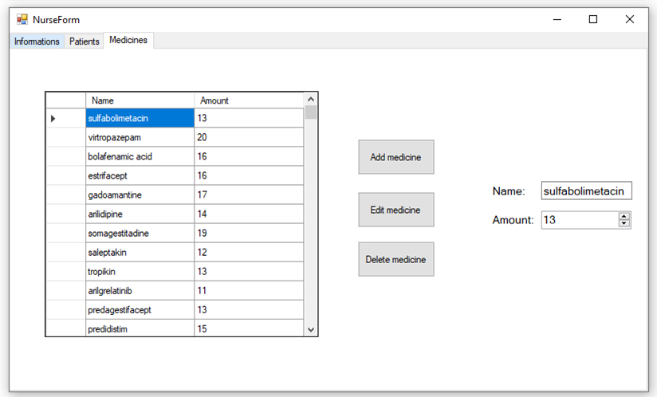
## Rehabilitator Form
### Informations
Contains base informations about logged in employee.
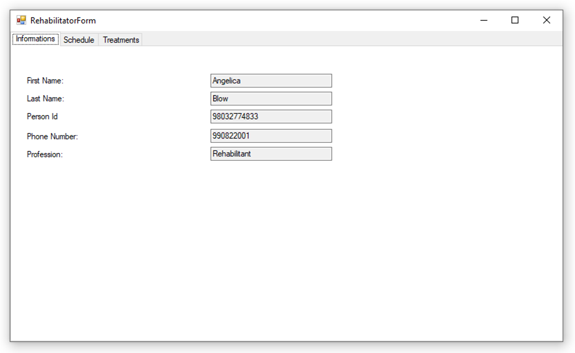
### Schedule
Allows to manage treatments in schedule for logged in rehabilitator.
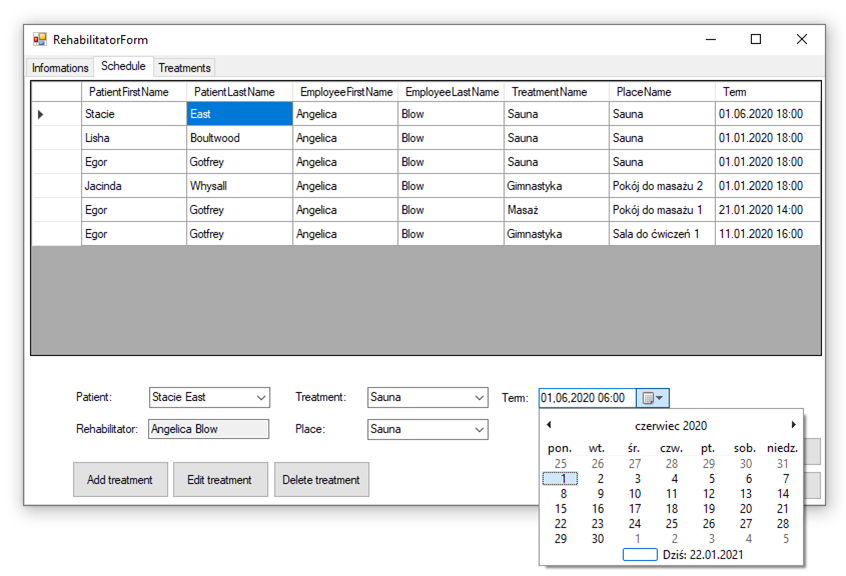
### Treatments
Allows to manage treatments.
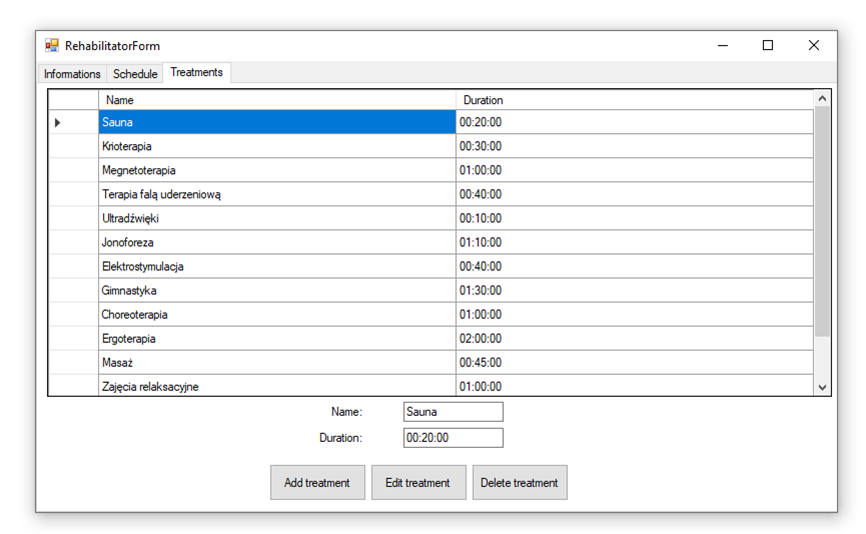

# Collaborator
* [ :upside_down_face: Szado12](https://github.com/Szado12)
* [ :slightly_smiling_face: TGrochowski87](https://github.com/TGrochowski87)
* [ :superhero_woman: Halszka99](https://github.com/halszka99)
